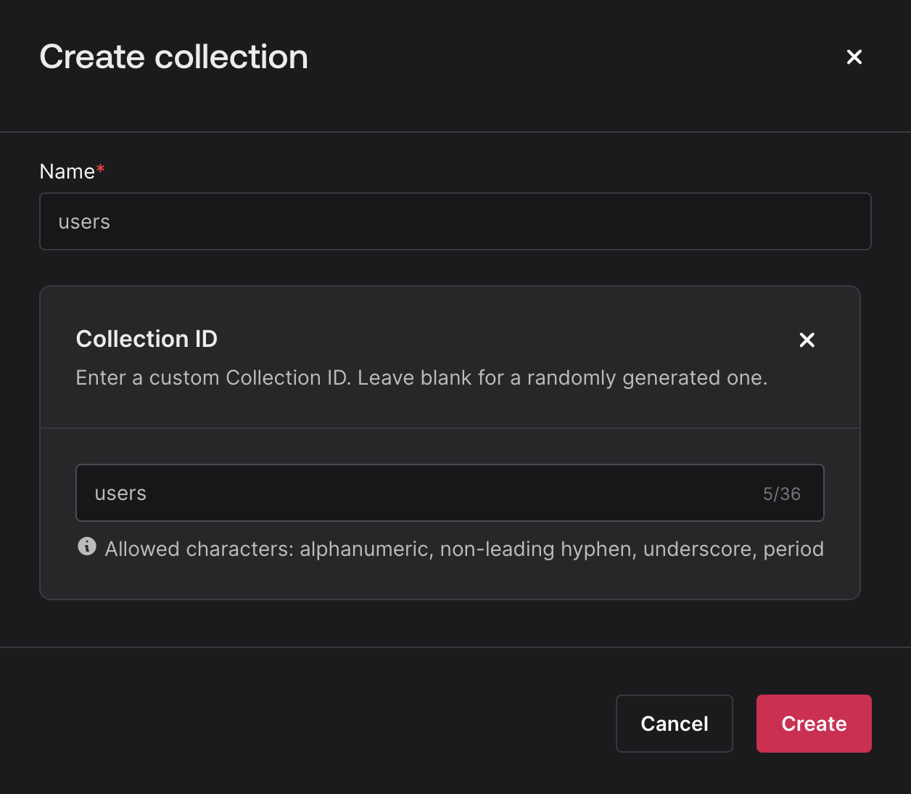
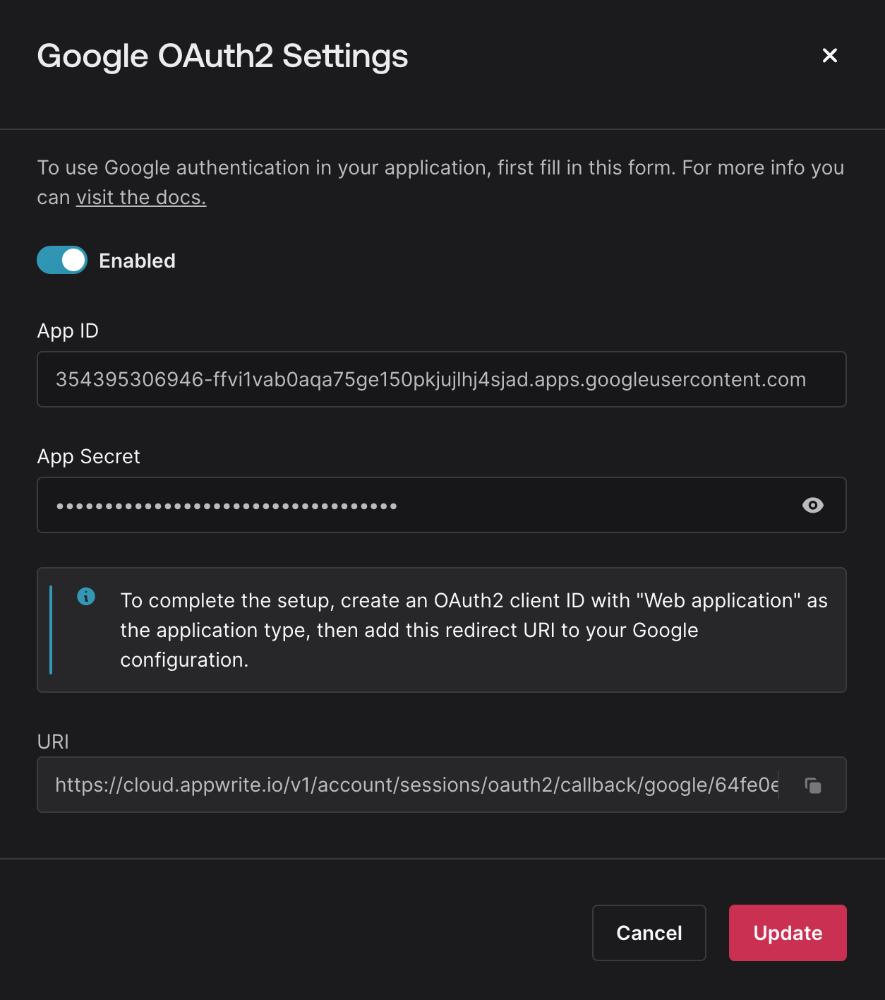
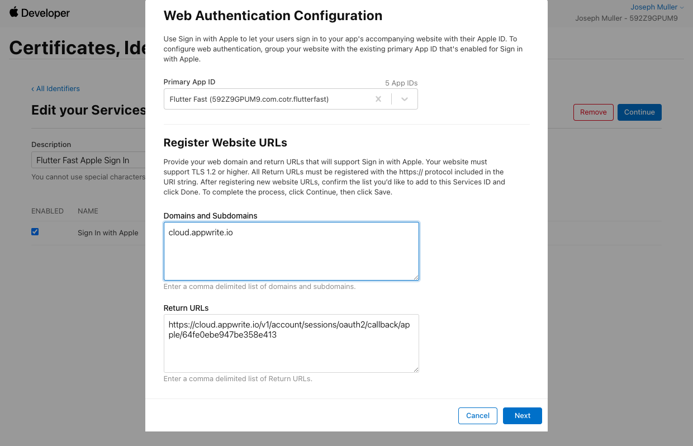
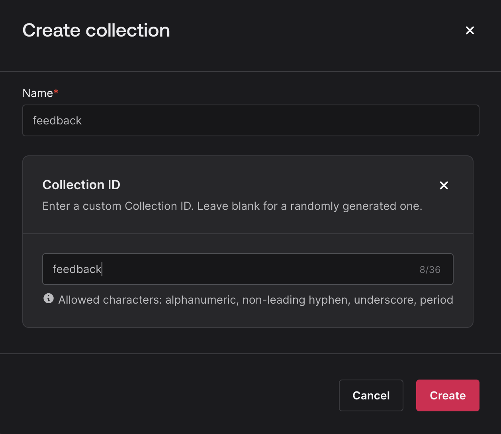
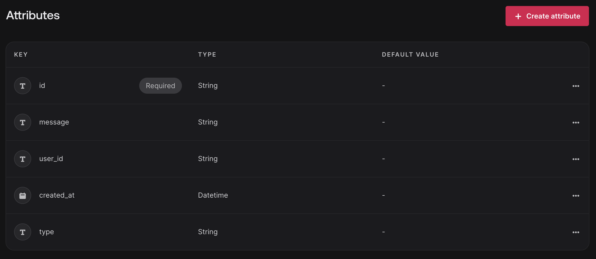
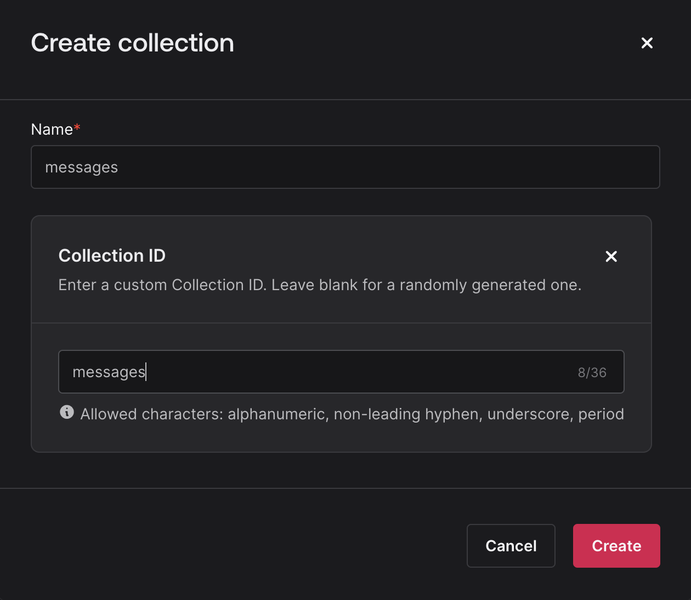

This page explains how to set up your Flutter Fast Appwrite project.

## Setup

### Before Generating Your App
Create a new [Appwrite project](https://cloud.appwrite.io/console/organization-6496393dc5f3f1d8dafb). On the "Overview" tab, scroll to the bottom and add a new Platform.

1. Select Flutter
2. Select iOS
3. Add you app name and iOS bundle ID
4. Hit next a few times

> You need to register each of the platforms you want to support in the Appwrite console.

Create a new collection called "users" in your Appwrite project.



Add the following attributes:

| Attribute | Type | Size |
|-----------|------|------|
| id | String | 128 |
| email | String | 128 |
| first_name | String | 128 |
| last_name | String | 128 |
| phone | String | 15 |
| onboarded | Boolean | |
| date_of_birth | DateTime| |
| created_at | DateTime| |
| last_login | DateTime| |

> Make sure the "users" collection is enabled on the settings tab. Also ensure that the create, read, and update permissions are enabled for "Any" in the permissions section.

### After Generating Your App

Follow the instructions on the Appwrite package page. Add the following section to your `AndroidManifest.xml` file:

```xml
<activity android:exported="true"
            android:name="com.linusu.flutter_web_auth_2.CallbackActivity">
            <intent-filter android:label="flutter_web_auth_2">
                <action android:name="android.intent.action.VIEW" />
                <category android:name="android.intent.category.DEFAULT" />
                <category android:name="android.intent.category.BROWSABLE" />
                <data android:scheme="appwrite-callback-[PROJECT ID]" />
            </intent-filter>
</activity>
```

### Google Sign In

On the Auth tab in the Appwrite console, enable the Google sign in method. [Create an OAuth 2.0 client ID for web](https://console.cloud.google.com/apis/credentials?project=flutter-fast).

Click on the client you just created and:
1. Copy the client ID into your Appwrite console
2. Copy the client secret into your Appwrite console
3. Add the authorized redirect URI from your Appwrite console into the 



### Apple Sign In
On the Auth tab in the Appwrite console, enable the Apple sign in method.

**Bundle ID**:
This is actually the _Service ID_ you will create below.

**Key ID**:
Sign into your Apple developer console and navigate to the [Keys](https://developer.apple.com/account/resources/authkeys/list) section. Create a new key and enable the Sign in with Apple capability. Copy the Key ID and paste it into your Appwrite console.

**P8 file**:
Download the P8 file from the same page and upload it to your Appwrite console. You can open it in a text editor to copy the contents.

**Team ID**:
Copy your Team ID from the [Membership](https://developer.apple.com/account/#/membership) section of the Apple developer console and paste it into your Appwrite console.

1. On the [Identifiers](https://developer.apple.com/account/resources/identifiers/list/serviceId) tab, add a new identifier and select "Service IDs". 
2. Create a new service ID and enable the Sign in with Apple capability. 
3. Configure the Sign In with apple capability and add the redirect URI from your Appwrite console. 



> This Service ID is the "Bundle ID" you will use in your Appwrite console 🙃

**Troubleshooting**
If you are seeing an error that says "OAuth provider failed to return email", you may need to [reset your Apple ID for your app](https://stackoverflow.com/a/65518275/12806961):

1. iPhone Settings
2. Apple ID
3. Password & Security
4. Apple ID Logins
5. Your App
6. Stop using Apple ID


### Feedback
To support the feedback feature, create a new collection called "feedback" in your Appwrite project.



Add the following attributes:



| Attribute | Type | Size |
|-----------|------|------|
| id | String | 128 |
| message | String | 2000 (You decide) |
| user_id | String | 128  |
| type | String | 128 |
| created_at | DateTime| |

> Make sure the "feedback" collection is enabled on the settings tab. Also ensure that the create and read permissions are enabled for "Users" in the permissions section.


### Chat

To support the social chat feed feature, create a new collection called "messages" in your Appwrite project.



Add the following attributes:


| Attribute | Type | Size |
|-----------|------|------|
| id | String | 128 |
| message | String | 2000 (You decide) |
| sender_id | String | 128 |
| created_at | DateTime| |

> Make sure the "messages" collection is enabled on the settings tab. Also ensure that the create, read, update, and delete permissions are enabled for "Users" in the permissions section.