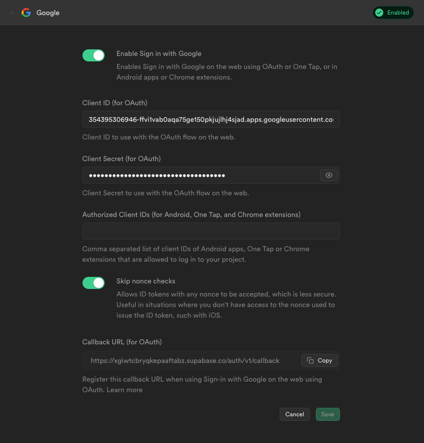
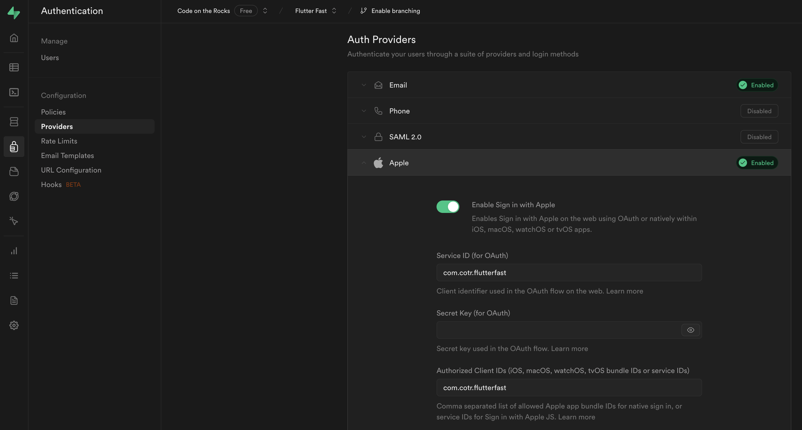
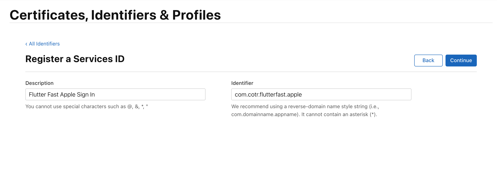
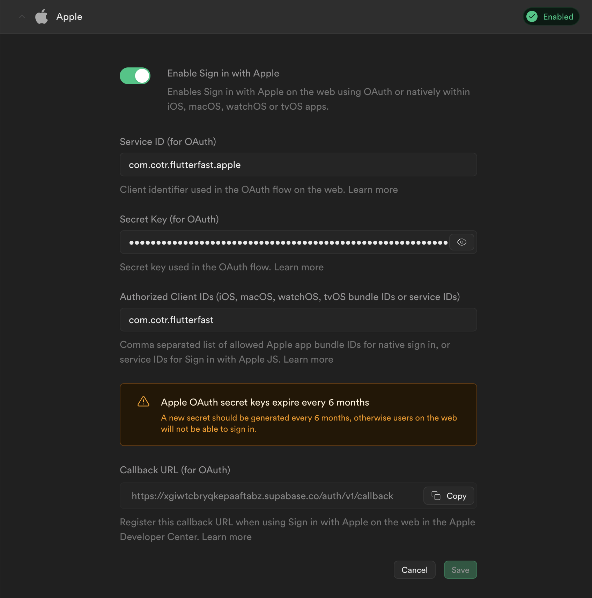
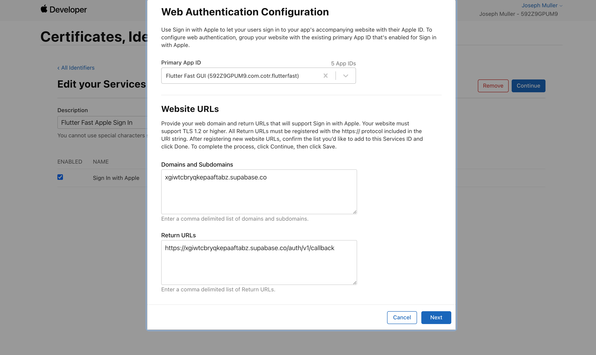
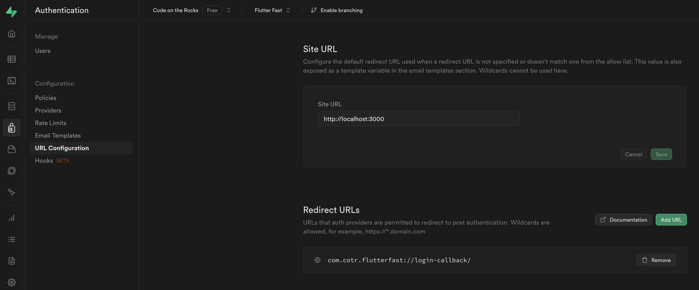

Setup you Flutter Fast project with Supabase.

## Setup

### Before Generating Your App

Create a Supabase account and project: https://supabase.com/

### After Generating Your App

After creating your Supabase project, add the following variables to your `config.json` file:

```
"SUPABASE_URL": "",
"SUPABASE_ANON_KEY": ""
```

The `SUPABASE_URL` value can be found in the dashboard here:

> All Projects -> Your Project -> Project Settings -> API -> Project URL

The `SUPABASE_ANON_KEY` value can be found on the same page:

> All Projects -> Your Project -> Project Settings -> API -> Project API keys (anon public)

The [Flutter setup steps](https://supabase.com/docs/guides/getting-started/quickstarts/flutter) will be completed by the Flutter Fast CLI.

## Google Sign In
- [Login with Google Supabase documentation](https://supabase.com/docs/guides/auth/social-login/auth-google)
- [Supabase Flutter SDK - Auth](https://supabase.com/docs/reference/dart/auth-signinwithoauth)


Navigate to the Authentication tab in your Supabase console, select the "Providers" section, and enable Google Sign In.



Next add the [google_sign_in](https://pub.dev/packages/google_sign_in) package to your `pubspec.yaml`.

### Android
[Create a SHA1 fingerprint](https://developers.google.com/android/guides/client-auth). To do this, you'll first need to create your release key:

```shell
keytool -genkey -v -keystore ~/Dev/keys/flutterfast.jks -keyalg RSA -keysize 2048 -validity 10000 -alias upload
```

Then you can list the details of that key to find the SHA1:

```shell
keytool -list -v -alias upload  -keystore ~/Dev/keys/flutterfast.jks
```

The SHA1 and SHA256 will be listed under "Certificate fingerprints". Jot these down for later.

You will also need your debug SHA1 which you can find using this command (password is "android"):

```shell
keytool -list -v -alias androiddebugkey -keystore ~/.android/debug.keystore
```

[Create a new credential in your Google Cloud console](https://console.cloud.google.com/apis/credentials).

1. Click "Create credentials"
2. Select "OAuth client ID"
3. Select your application type (Android)
4. Enter your credential name, package name, and SHA1 from above
5. Click "Create"

Once the credential is created, locate it on the credentials tab and copy the client ID. Add this to the `config.json` file under the `GOOGLE_ANDROID_CLIENT_ID` key.

### iOS
[Create a new credential in your Google Cloud console](https://console.cloud.google.com/apis/credentials).

1. Click "Create credentials"
2. Select "OAuth client ID"
3. Select your application type (iOS)
4. Enter your credential name, package name, and SHA1 from above
5. Click "Create"

Once the credential is created, locate it on the credentials tab and copy the client ID. Add this to the `config.json` file under the `GOOGLE_IOS_CLIENT_ID` key.

### Web
[Create a new credential in your Google Cloud console](https://console.cloud.google.com/apis/credentials).

1. Click "Create credentials"
2. Select "OAuth client ID"
3. Select your application type (iOS)
4. Enter your credential name, package name, and SHA1 from above
5. Click "Create"

Once the credential is created, locate it on the credentials tab and copy the client ID. Add this to:

1. The `config.json` file under the `GOOGLE_WEB_CLIENT_ID` key
2. `index.html` in the meta tag named "google-signin-client_id"

You will also need to add this value in your Supabase console under "Authorized Client IDs" in the Google Sign In section.

Lastly, enable the [People API](https://console.cloud.google.com/apis/api/people.googleapis.com/metrics?project=flutter-fast) in th GCP console.


---

## Apple Sign In

- [Supabase Login with Apple](https://supabase.com/docs/guides/auth/social-login/auth-apple?platform=flutter)

Navigate to the Authentication tab in your Supabase console, select the "Providers" section, and enable Apple Sign In.



Add the [sign_in_with_apple](https://pub.dev/packages/sign_in_with_apple) package to your `pubspec.yaml`.

### Android
To start, navigate to the [identifiers](https://developer.apple.com/account/resources/identifiers/list/bundleId) page in your Apple developer console. Select the "+" button and create a new "Services ID".



Copy the identifier (ex. `com.cotr.flutterfast.apple`) for later.

Next, [create a Sign in with Apple Service](https://developer.apple.com/account/resources/services/list) from the Apple developer console. When it asks for domains, use the domain of your Supabase project (ex. `xgiwtcbryqkepaaftabz.supabase.co`).

[Create a signing key](https://developer.apple.com/account/resources/authkeys/list) by navigating to the "Keys" section in your Apple Developer account and clicking the "+" button. Fill out the form and download the `.p8` file.

Use this [tool](https://supabase.com/docs/guides/auth/social-login/auth-apple?platform=web) from the Supabase docs to generate your secret key using the following items:

- The `.p8` file
- Your developer account ID (Upper right of the [developer console](https://developer.apple.com/account/resources/identifiers), under name)
- Your service ID (ex. `com.cotr.flutterfast.apple`)

Copy the generated secret key into the "Secret Key (for OAuth)" field on the Apple provider tab in your Supabase console.



Copy the callback URL from the Supabase console and add it to the "Return URLs" under Identifiers > Your Apple Sign In identifier > Configure in the Apple Developer Console.



When a user signs in with Apple, a browser window will open to authenticate the user. When they have successfully authenticated, the browser will redirect to the URL you specify in the `redirectTo` field in your app:

```dart
supabase.auth.signInWithOAuth(
  OAuthProvider.apple,
  redirectTo: 'my-scheme://login-callback',
);
```

For this to work, you need to setup [deep links](https://supabase.com/docs/guides/auth/native-mobile-deep-linking?platform=flutter). The Flutter Fast template includes a deep link configuration that looks like this:

```
<intent-filter android:label="OAuth">
  <action android:name="android.intent.action.VIEW" />
  <category android:name="android.intent.category.DEFAULT" />
  <category android:name="android.intent.category.BROWSABLE" />
  <!-- Accepts URIs that begin with "com.cotr.flutterfast://login-callback -->
  <data android:scheme="com.cotr.flutterfast"
      android:host="login-callback" />
</intent-filter>
```

In your Supabase console, under Authentication > URL Configuration, add the redirect URL (ex. `com.cotr.flutterfast://login-callback`)



### iOS

Open your project in Xcode and add the "Sign in with Apple" capability.


[Register iOS App IDs in Supabase dashboard](https://supabase.com/dashboard/project/_/auth/providers)

### Web

In the Supabase console, navigate to Authentication > URL Configuration > Site URL. When developing, you can specify the web port using the `--web-port=5000` argument. For the OAuth redirect to work in development, you need to be running the app on the port specified in your Supabase console.
